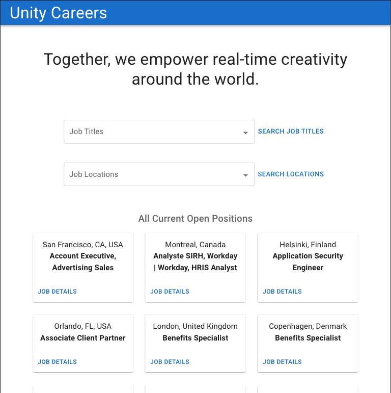
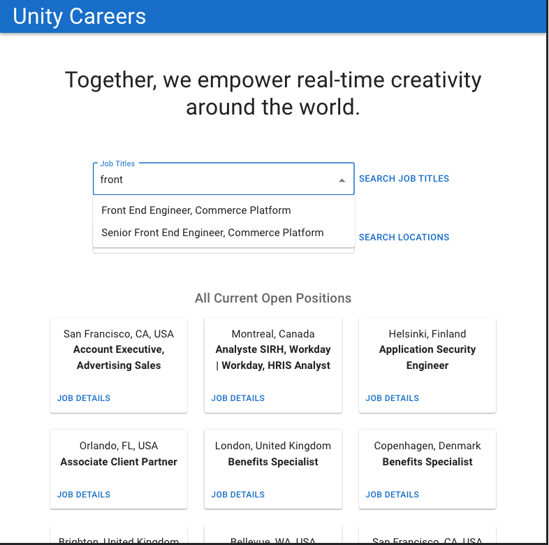
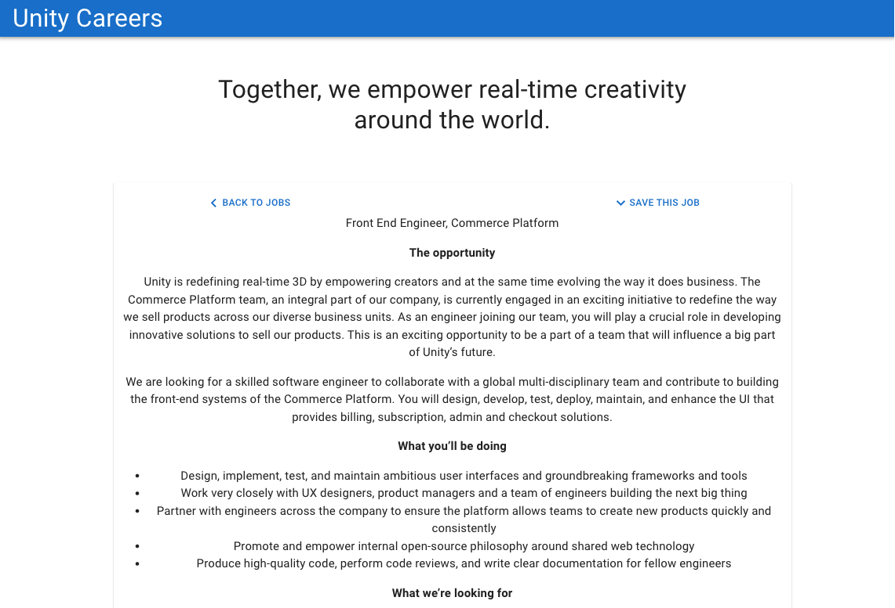
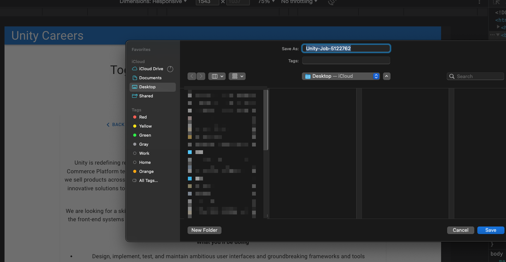

# company-career-page
#### Company Career Page in React using MUI with search and save! 🐬 🦄 🐳 🐙

## Table of Contents
**[Quick Links](#Quick-Links)** 
**[First Looks](#First-Looks)** 
**[Set Up and Run Locally](#Set-Up-and-Run-Locally)** 
**[Next Steps to Continue](#Next-Steps-to-Continue)** 

## Quick Links
### click here to view live site --> [company-career-page](https://company-career-page.netlify.app/)

## First Looks
### 
### 
### 
### 

## Set Up and Run Locally
- 1. clone project on your local machine [cloning-a-repository](https://docs.github.com/en/repositories/creating-and-managing-repositories/cloning-a-repository)
- 2. open a project in your IDE (ie: visual studio)
- 3. npm run start and it should open in your browser : note the .env file is added back so the API endpoint should dynamically set when the fetch is made

## Next Steps to Continue
- show the job title and or id or another dynamic routing data as url params as a user clicks through the job board, specific job, and search results 🐙
- create child components for the search, detailed job, and utilities for some of the functions used like the fetch and handleclicks while of course passing children state as props as needed. right now they all live in the <Careers/> component and it's best to have each component have one job to do especially to help control state 🐬
- speaking of state, next steps is also to hook in redux and hoist up that state to one global spot for all to use and be updated! 🦄
- search time! okay i did not wanna go over this time limit  y'all set so I just made the search show a list of the titles or locations if they existed... obviously a relevant search would be to select from the drown down or, input type and when you find whatcha want and click the button, the list would re-render with the array of job objects again based on the id so you could then click on each one 🦩

#### Objective:
- Take Home assignment is pretty free form, as in there is no “correct” result. We are interested in knowing how you solve a task and set of requirements and user stories, as well how you approach the application from an architectural standpoint. 
- Visually you can go with what makes sense or you think you can solve the problem in the best and most efficient way, custom styling to Material UI, is all accepted. But make it as user friendly and nice as possible.
- Create a React application (clone this repo) with JavaScript / TypeScript support that consumes the API endpoint of Greenhouse (specifications in the bottom of this document).
 - Greenhouse is our recruitment software which is also what our careers.unity.com is built upon.
- Please do not share endpoints, or use more effort than 2 - 3 hours max.

#### User stories
- As a User, I should be able to get an overview of all job positions, so I can find the relevant job positions.
- As a User, I should be able to get a detailed view of a single job on a page, so I can read and share.
- Bonus As a User, I should be able to search through the overview using the titles, so I can quickly find positions relevant for me.

#### Requirements
- React
- Typescript / JavaScript
- MaterialUI

#### Think of using
- TS Interface
- Dynamic routes
- Use Hooks (state, effect etc.)

## License

[MIT License](https://opensource.org/licenses/MIT)

**[Back Up To Top](#e-commerce-site)**
